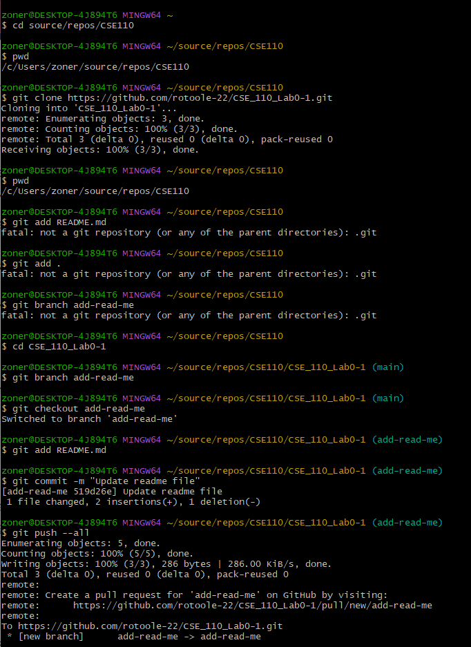
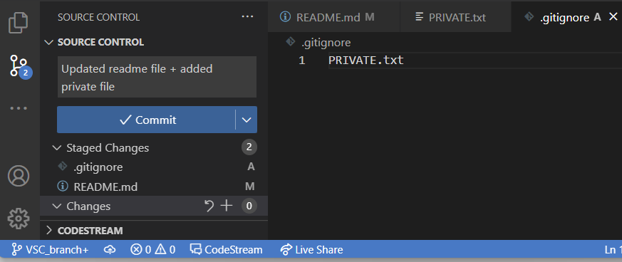

# Ryan O'Toole
**Note: This page will likely be updated in the future.**
This is my github page.

> Hello!

I have never uploaded a github page before, so if this doesn't work, please `help` me.
This website was created for CSE 110, a class taught by [Thomas Powell](https://classes.pint.com/).
Click [here](README.md) for the readme file.
Here's how I made some of the branches for my repository:

- TestA
- TestB
- TestC

1. Test1
2. Test2
3. Test3

- [x] TestCheck
- [ ] TestUncheck

[Back to top](#ryan-otoole)